<!-- GENERATED by `pnpm spec:graph` — do not edit.
     The authority is the `Depends on:` declaration in each capability's
     Purpose and in each requirement; this file is a view of it, and
     `pnpm spec:graph --check` (part of `pnpm spec:check`) fails when the
     two disagree. Regenerate in the commit that changes a declaration. -->

# Capability dependency graph

Derived from `openspec/specs/` overlaid with every open change, so it shows
the corpus as it will stand once the open changes fold. An arrow reads
**depends on**: relax what it points at and the requirement declaring it stops
making sense. Edge labels count the requirement-grain dependencies crossing
that edge, and a dashed node is one an open change mints.

`game-engine` and `global-invariants` are depended on by at least half the
corpus; those edges are drawn faint so the rest of the structure stays
legible, and they are what anchor the layering — every capability sinks to its
own depth above them.

The graph is acyclic — `pnpm spec:check` enforces that — and rooted at
`game-engine`, which declares no dependencies of its own. Counts are
deliberately absent from this prose: they would go stale in anyone's memory
and churn this file on edits that never touched the graph.
`pnpm spec:graph --json` has them.

```mermaid
flowchart TD
  classDef open stroke-dasharray:5 3;
  classDef base stroke-width:2px;

  accounts-and-profiles["accounts-and-profiles"]:::open
  application-shell["application-shell"]:::open
  bot-configuration["bot-configuration"]:::open
  bot-framework["bot-framework"]:::open
  decision-transparency["decision-transparency"]:::open
  game-configuration["game-configuration"]:::open
  game-engine["game-engine"]
  game-lifecycle["game-lifecycle"]:::open
  global-invariants["global-invariants"]
  identity-and-authorization["identity-and-authorization"]:::open
  live-game-observation["live-game-observation"]:::open
  operator-control["operator-control"]:::open
  platform-integrations["platform-integrations"]:::open
  platform-persistence["platform-persistence"]:::open
  replay-and-audit["replay-and-audit"]:::open
  rooms-and-matchmaking["rooms-and-matchmaking"]:::open
  team-management["team-management"]:::open
  team-server-management["team-server-management"]:::open
  test-sequences["test-sequences"]
  tournaments["tournaments"]:::open
  turn-pacing["turn-pacing"]:::open
  visual-tester["visual-tester"]

  accounts-and-profiles -->|9| global-invariants
  accounts-and-profiles -->|2| identity-and-authorization
  accounts-and-profiles -->|2| replay-and-audit
  accounts-and-profiles -->|5| team-management
  application-shell -->|1| game-engine
  application-shell -->|5| global-invariants
  bot-configuration -->|8| bot-framework
  bot-configuration -->|5| global-invariants
  bot-configuration -->|1| identity-and-authorization
  bot-configuration -->|4| team-management
  bot-framework -->|4| game-engine
  bot-framework -->|10| global-invariants
  bot-framework -->|6| operator-control
  decision-transparency -->|6| bot-framework
  decision-transparency -->|7| global-invariants
  decision-transparency -->|3| operator-control
  game-configuration -->|1| application-shell
  game-configuration -->|12| game-engine
  game-configuration -->|17| global-invariants
  game-lifecycle -->|7| game-configuration
  game-lifecycle -->|2| game-engine
  game-lifecycle -->|24| global-invariants
  game-lifecycle -->|2| identity-and-authorization
  game-lifecycle -->|3| team-server-management
  global-invariants -->|4| game-engine
  identity-and-authorization -->|35| global-invariants
  live-game-observation -->|5| game-engine
  live-game-observation -->|7| global-invariants
  live-game-observation -->|4| identity-and-authorization
  operator-control -->|4| game-engine
  operator-control -->|14| global-invariants
  operator-control -->|1| identity-and-authorization
  operator-control -->|2| live-game-observation
  platform-integrations -->|3| game-lifecycle
  platform-integrations -->|3| global-invariants
  platform-integrations -->|10| identity-and-authorization
  platform-persistence -->|4| global-invariants
  replay-and-audit -->|4| decision-transparency
  replay-and-audit -->|5| game-engine
  replay-and-audit -->|3| game-lifecycle
  replay-and-audit -->|19| global-invariants
  replay-and-audit -->|1| identity-and-authorization
  replay-and-audit -->|5| live-game-observation
  replay-and-audit -->|4| operator-control
  replay-and-audit -->|2| turn-pacing
  rooms-and-matchmaking -->|3| game-configuration
  rooms-and-matchmaking -->|7| game-lifecycle
  rooms-and-matchmaking -->|8| global-invariants
  rooms-and-matchmaking -->|2| team-management
  team-management -->|7| global-invariants
  team-management -->|3| identity-and-authorization
  team-server-management -->|13| global-invariants
  team-server-management -->|1| identity-and-authorization
  team-server-management -->|4| team-management
  test-sequences -->|4| game-engine
  tournaments -->|7| game-lifecycle
  tournaments -->|6| global-invariants
  tournaments -->|2| rooms-and-matchmaking
  tournaments -->|3| team-server-management
  turn-pacing -->|2| bot-configuration
  turn-pacing -->|2| bot-framework
  turn-pacing -->|5| game-engine
  turn-pacing -->|8| global-invariants
  turn-pacing -->|7| operator-control
  visual-tester -->|8| game-engine
  visual-tester -->|4| test-sequences

  class game-engine,global-invariants base;
  linkStyle 0,4,5,7,10,11,14,17,18,20,21,25,26,27,29,30,34,36,38,40,47,49,51,54,56,61,62,64 stroke-opacity:0.25;
```

